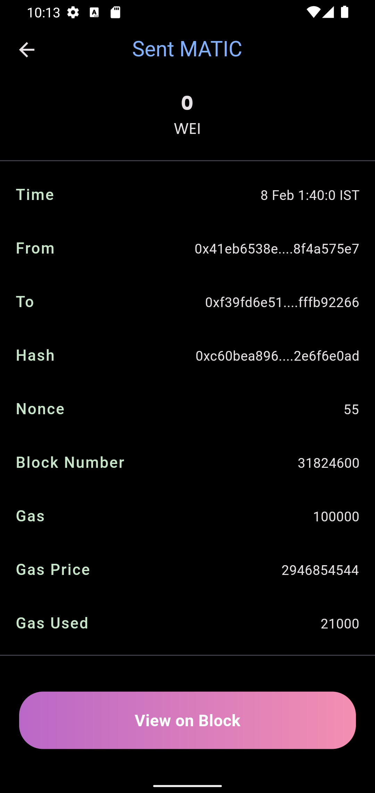

<a name="readme-top"></a>

[![Contributors][contributors-shield]][contributors-url]
[![Forks][forks-shield]][forks-url]
[![Stargazers][stars-shield]][stars-url]
[![Issues][issues-shield]][issues-url]

<!-- [![MIT License][license-shield]][license-url] -->

[![LinkedIn][linkedin-shield]][linkedin-url]

<br />
<div align="center">
  <a href="https://github.com/subrotokumar/nyx/">
    
  </a>

  <h3 align="center">Comet</h3>

  <p align="center">
    Not just a crypto wallet
    <br />
    <a href="https://comet-zeta.vercel.app/"><strong>Open <strong>Application</strong> »</strong></a>
    <br />
    <br />
    <a href="https://github.com/subrotokumar/nyx">View Demo</a>
    ·
    <a href="https://github.com/subrotokumar/nyx/issues">Report Bug</a>
    ·
    <a href="https://github.com/subrotokumar/comet/issues">Request Feature</a>
  </p>
</div>

<!-- TABLE OF CONTENTS -->
<details>
  <summary>Table of Contents</summary>
  <ol>
    <li>
      <a href="#about-the-project">About The Project</a>
      <ul>
        <li><a href="#built-with">Built With</a></li>
      </ul>
    </li>
    <li>
      <a href="#getting-started">Getting Started</a>
      <ul>
        <li><a href="#prerequisites">Prerequisites</a></li>
        <li><a href="#installation">Installation</a></li>
      </ul>
    </li>
    <li><a href="#usage">Usage</a></li>
    <li><a href="#roadmap">Roadmap</a></li>
    <li><a href="#contributing">Contributing</a></li>
    <!-- <li><a href="#license">License</a></li> -->
    <li><a href="#contact">Contact</a></li>
    <li><a href="#acknowledgments">Acknowledgments</a></li>
  </ol>
</details>

<!-- ABOUT THE PROJECT -->

## About The Project

<br>
<p align='center'>
<a href='https://comet-zeta.vercel.app/'>
<pre>
        
</pre>
</a>
</p>
<br>


<p align="right">(<a href="#readme-top">back to top</a>)</p>

### Built With

Frameworks/libraries used to this project:

- Dart
- Flutter
- Solidity
- Web3Dart
- API

<p align="right">(<a href="#readme-top">back to top</a>)</p>

<!-- GETTING STARTED -->

## Getting Started

To get a local copy up and running follow these simple example steps.

### Prerequisites

The list things you need to use the application and how to install them.

- Flutter SDK
- Android Studio
- Android toolchain
- RPC Url (Alchemy, Ouicknode)

### Installation

1. Clone the repo
   ```sh
   git clone https://github.com/subrotokumar/comet.git
   ```
3. Move to project folder

   ```sh
   ch comet
   ```

4. Install packages and dependencies:

   ```sh
   flutter pub get
   ```

5. Set Api key / RPC Url in `comet/utils/credential.dart`
   ```
    String get polygonscanApi => '';
    String get etherscanApi => '';
    String get mainnetRPC => '';
    String get mumbaiRPC => '';
    String get polygonRRC => '';
    String get goerliRPC => '';
   ```
6. Run application locally in debug/release mode

   ```sh
   flutter run --debug
   ```

   or

   ```sh
   flutter run --release
   ```

<p align="right">(<a href="#readme-top">back to top</a>)</p>

<!-- USAGE EXAMPLES -->

## Usage

ChatGPT and OpenAI is becoming increasingly popular as an alternative to more traditional customer service methods, such as phone calls or emails.

_For more info about OpenAI, please refer to the [Documentation](https://beta.openai.com/docs/introduction/overview)_

<p align="right">(<a href="#readme-top">back to top</a>)</p>

<!-- ROADMAP -->

## Roadmap

- [X] Polygon and Mumbai support
- [x] NFT section
- [ ] Portfolio generator
- [ ] Live Market Feed
- [ ] Add network feature for other evm-based chain.
- [ ] Ability to interect with nfts
- [ ] Creation of more account from same recovery phase

See the [open issues](https://github.com/subrotokumar/comet/issues) for a full list of proposed features (and known issues).

<p align="right">(<a href="#readme-top">back to top</a>)</p>

<!-- CONTRIBUTING -->

## Contributing

Contributions are what make the open source community such an amazing place to learn, inspire, and create. Any contributions you make are **greatly appreciated**.

If you have a suggestion that would make this better, please fork the repo and create a pull request. You can also simply open an issue with the tag "enhancement".
Don't forget to give the project a star! Thanks again!

1. Fork the Project
2. Create your Feature Branch (`git checkout -b feature/FeatureName`)
3. Commit your Changes (`git commit -m 'Added FeatureName'`)
4. Push to the Branch (`git push origin feature/FeatureName`)
5. Open a Pull Request

<p align="right">(<a href="#readme-top">back to top</a>)</p>

<!-- LICENSE -->

<!-- CONTACT -->

## Contact

Subroto Kumar - [@subrotokr](https://twitter.com/subrotokr) - subrotokumar@outlook.in

Project Link: [https://github.com/subrotokumar/comet](https://github.com/subrotokumar/comet)

<p align="right">(<a href="#readme-top">back to top</a>)</p>

<!-- ACKNOWLEDGMENTS -->

## Powered by

- Alchemy-SDK
- CoinGecko
- Etherscan

<p align="right">(<a href="#readme-top">back to top</a>)</p>

<!-- MARKDOWN LINKS & IMAGES -->
<!-- https://www.markdownguide.org/basic-syntax/#reference-style-links -->

[contributors-shield]: https://img.shields.io/github/contributors/subrotokumar/comet.svg?style=for-the-badge
[contributors-url]: https://github.com/subrotokumar/comet/graphs/contributors
[forks-shield]: https://img.shields.io/github/forks/subrotokumar/comet.svg?style=for-the-badge
[forks-url]: https://github.com/subrotokumar/comet/network/members
[stars-shield]: https://img.shields.io/github/stars/subrotokumar/nyx.svg?style=for-the-badge
[stars-url]: https://github.com/subrotokumar/nyx/stargazers
[issues-shield]: https://img.shields.io/github/issues/subrotokumar/nyx.svg?style=for-the-badge
[issues-url]: https://github.com/subrotokumar/nyx/issues
[license-shield]: https://img.shields.io/github/license/subrotokumar/nyx.svg?style=for-the-badge
[license-url]: https://www.linkedin.com/in/kumarsubroto
[linkedin-shield]: https://img.shields.io/badge/-LinkedIn-black.svg?style=for-the-badge&logo=linkedin&colorB=555
[linkedin-url]: https://linkedin.com/in/kumarsubroto
[product-screenshot]: ./assets/images/banner.png
